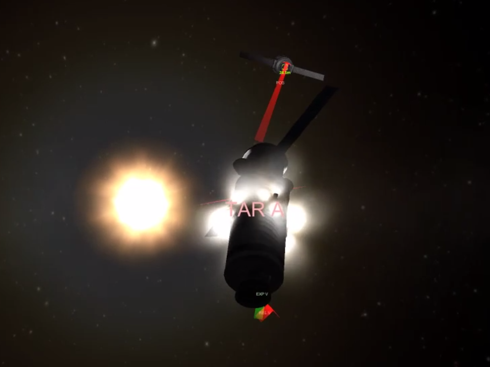

# 坎巴拉太空计划 kOS 脚本

## 简介

`坎巴拉太空计划（Kerbal Space Program）`，简称 `KSP`。在我眼里就是一个航天类的模拟器，只不过加入了一些娱乐因素，更好玩一些。比较吸引我的主要特点：

- 接近真实的力学、气动、火箭和天体动力学模型，类太阳系星系。可以和所学知识、工作结合起来，可以参考人类航天的历史和成果。

- [kOS: Kerbal Operating System](https://ksp-kos.github.io/KOS/) 是一个扩展 MOD，允许用脚本的方式获得飞行器状态、环境数据，并对飞行器进行控制。可以轻松实现自动化控制、路径规划算法的测试。当然，玩无人机都分不清前后左右的我手动是不可能完成空间站对接的，手残工程师的福音。

- 充足的资金可以让力大砖飞，不必为 1 kg 载荷斤斤计较，不必去钻研火箭设计的知识。

- 任务会引导玩家从简单的火箭测试开始，一步步完成轨道飞行测试、中继卫星布置、空间站部署、星际旅行等。向航天事业的先驱们致敬！

## 我的工作内容/成就

### 1. 全自动近地轨道游览

一艘满载两人的无人驾驶火箭，在[脚本](boot/travel_fast.ks)的控制下进入地球环绕轨道，然后进入大气层，最后伞降在大海上。全程大约 7 分钟，用以完成土豪上天的商业合同，是坎巴拉太空中心主要经济来源。入轨就返回，环球什么的不存在的，只要完成合同，越快越好（狗头

负反馈控制火箭姿态和 throttle，先把远地点送到 80 km，滑行之远地点附近把近地点推到 70 km。

**TODO**：下了龙飞船和 Falcon 9 的 MOD（[Tundra](https://forum.kerbalspaceprogram.com/index.php?/topic/166915-16x-tundra-exploration-v1305-march-6th-spacex-falcon-9-dragon-v2-and-starship/)），一次 7 个人，最近报名的土豪有点多，得提高效率。马斯克高啊。

### 2. 在轨飞行器对接

视频：[自动发射和对接程序演示 - bilibili](https://www.bilibili.com/video/av45130158)。全长 12 分钟，未经剪辑，对接从 7:15 开始。有时间会把剪辑、加速后的视频放出来。

距离远时先用火箭加速、维持方向、减速，近距离用 RCS 调整姿态并对接。用点火的方式辨识动力模型（阶跃），但因为向心力的影响和速度差分的误差导致结果不太好。当时科技树还造不出加速度计，之后会改进。[脚本](docking.ks)

大油门转向和推进，手操是不可能的，不敢不敢。

**TODO**

- 用加速度计替代速度差分，获得准确的加速度。
- 考虑椭圆轨道和向心力。
- 利用发动机和推进器在真空中的推力数据资料和飞行器质量替代现有的辨识模型。
- 加大反馈，加模型预测，动作要更迅捷准确。

### 3. SpaceX 那样的火箭定点回收

[Kerbal Reusability Expansion](https://forum.kerbalspaceprogram.com/index.php?/topic/138871-161-kre-kerbal-reusability-expansion/) 提供了 Falcon 用来调整姿态的 Grid Fin，为仿造 Falcon 降低了难度。[Tundra](https://forum.kerbalspaceprogram.com/index.php?/topic/166915-16x-tundra-exploration-v1305-march-6th-spacex-falcon-9-dragon-v2-and-starship/) 更是提供了高度集成、外表和参数相似的 SpaceX 系列飞行器。

[Trajectory](https://forum.kerbalspaceprogram.com/index.php?/topic/162324-151-131-trajectories-v221-2018-04-28-atmospheric-predictions/) 可以估算仅大气和重力作用下火箭的轨迹和落点，火箭脱离后点火调整落点到预定降落区域。但是下降阶段发动机减速会极大缩短滑行距离。

最好的方式是将整个过程进行优化求解，得到不同状态下的最优策略或进行实时求解，以燃料消耗为优化目标，最高温度和气动压力为边界进行最优控制。但是涉及到过多超音速流体力学和飞行器方面的知识（可能还不止这些），个人采用以下方法调整轨迹：

- 利用火箭反推抬高/压低轨迹。
- 改变火箭姿态，利用空气升力改变轨迹。升力与气压、速度平方、升力面积成正比（[Lift Equation - NASA](https://www.grc.nasa.gov/WWW/k-12/rocket/lifteq.html)），在游戏中采集的数据证实了这一点，见 [Matlab Plot](doc/lift.png)。

测试用与 Falcon 9 质量相当的火箭，可以落在指定地点 5 米范围内。

**TODO**

- 使用 [Tundra](https://forum.kerbalspaceprogram.com/index.php?/topic/166915-16x-tundra-exploration-v1305-march-6th-spacex-falcon-9-dragon-v2-and-starship/) 的火箭模型，美观、强度更高。
- Falcon Heavy 那样的发射，助推器返回发射场，主火箭落在海上，载荷送入轨道。需要造一艘写着“Of course I still love you”的船，放在预定着陆点。
- 根据载荷不同调整发射和回收策略的脚本。打算参照 SpaceX 以往发射的轨迹进行测试，得到不同载荷下较好的轨迹。
- 剪辑视频以便展示。最好是载荷能和空间站进行个对接，这样工作展示就比较完整了。
